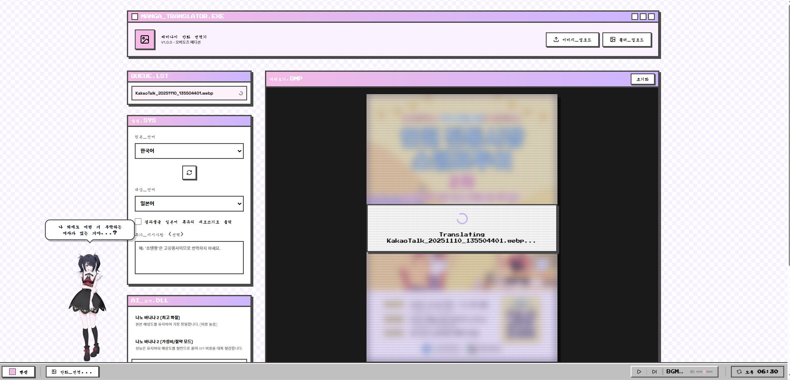
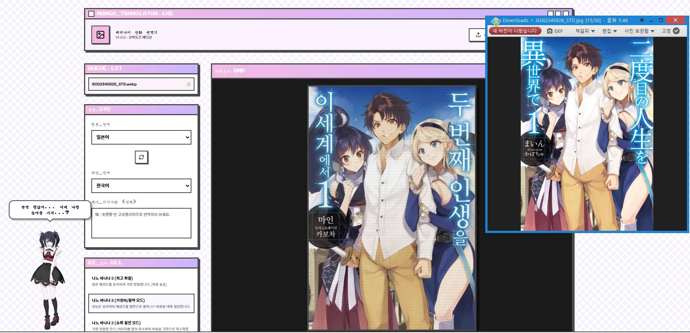
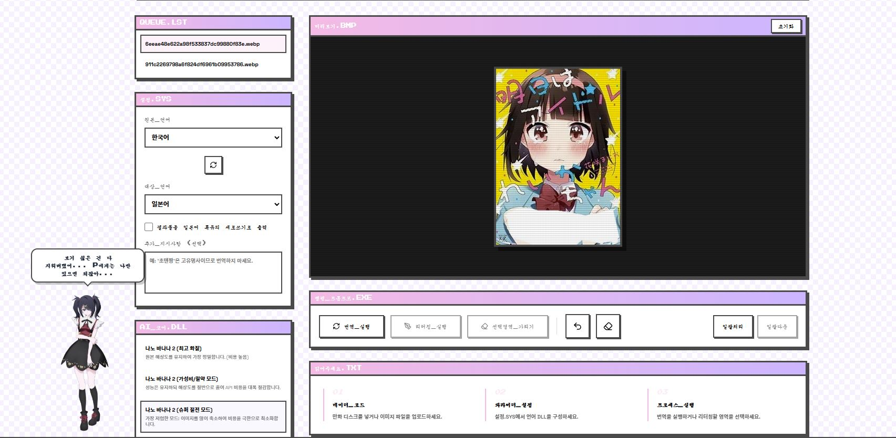

# 쵸텐짱의 제미나이 번역기 (만화 번역기)

Gemini 이미지 모델로 만화/웹툰 페이지의 말풍선 텍스트를 다른 언어로 번역해서 이미지 위에 그대로 다시 그려주는 웹 앱입니다. 원문을 완전히 지우고 번역문으로 재작화(typeset)하는 방식이라, 결과물이 바로 완성된 번역 페이지가 됩니다.

## 기능

- 이미지를 여러 장 올려 **일괄 번역**(자동 번역) 가능
- 원문/번역 언어 선택: 일본어·한국어·영어·중국어·스페인어·프랑스어·독일어·베트남어·태국어, 좌우 스왑 버튼 지원
- 세로쓰기(일본어) 텍스트 인식 등 만화 특유의 조판 규칙 고려
- **가리기(censor) 브러시**로 특정 영역을 흰색으로 덮은 뒤 번역 — 검열/수정 용도
- 실행취소(undo)로 이전 상태 복원
- 완료된 이미지를 압축(ZIP)해서 한 번에 다운로드
- 초텐쨩/아메 캐릭터가 진행 상황에 맞춰 말풍선으로 리액션, 배경음악(BGM) 플레이어 내장

## 스크린샷

> 배포판은 로그인이 필요하기 때문에, 아래 스크린샷으로 실제 사용 흐름을 소개합니다.

### 일괄 번역 (한국어 → 일본어)

이미지를 큐에 올리면 순서대로 자동 번역됩니다. 진행 상황에 맞춰 마스코트 초텐쨩이 말풍선으로 리액션합니다.



위에서 번역 중인 포스터의 실제 결과물입니다. 원본의 레이아웃·서체 느낌·디자인을 유지한 채 텍스트만 일본어로 재작화됩니다.

<p align="center">
  
</p>

### 번역 결과 비교 (일본어 → 한국어)

일본어 라이트노벨 표지를 한국어로 번역한 화면입니다. 오른쪽 뷰어의 원본과 비교하면, 세로쓰기 일본어 제목이 같은 자리에 한국어 세로 조판으로 다시 그려진 것을 확인할 수 있습니다.



### 가리기(censor) 브러시

이미지 일부가 검열(API 세이프티 필터)에 걸려 번역이 거부되는 경우, 해당 영역만 브러시로 가린 뒤 나머지 부분을 정상적으로 번역할 수 있습니다.



## 실행 방법

**요구 사항**: Node.js

```bash
npm install
```

`.env.local`에 자신의 Gemini API 키를 설정합니다.

```
GEMINI_API_KEY=여기에_발급받은_키
```

```bash
npm run dev
```

API 키는 [Google AI Studio](https://aistudio.google.com/)에서 발급받으며, 로컬 `.env.local`에만 저장됩니다(git에 커밋되지 않음 — `.env.example`은 값이 없는 템플릿입니다).

## 기술 스택

- React + TypeScript + Vite
- [`@google/genai`](https://www.npmjs.com/package/@google/genai) — Gemini 이미지 생성/편집 모델(`gemini-2.5-flash-image` 등)로 말풍선 텍스트 삭제 + 번역문 재작화
- JSZip — 번역 완료 이미지 일괄 압축 다운로드
