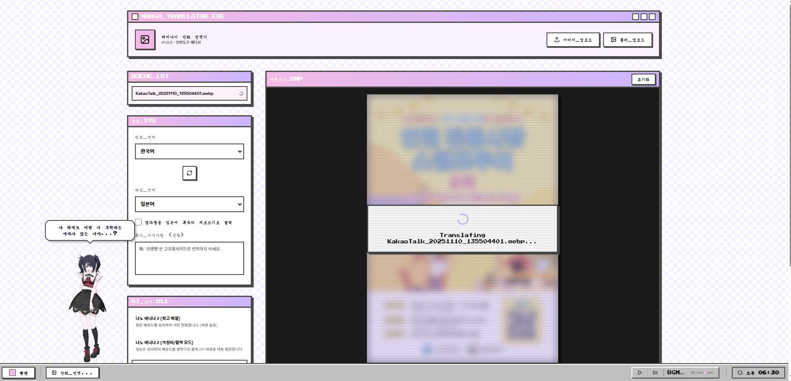
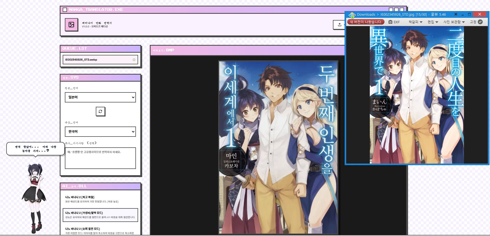
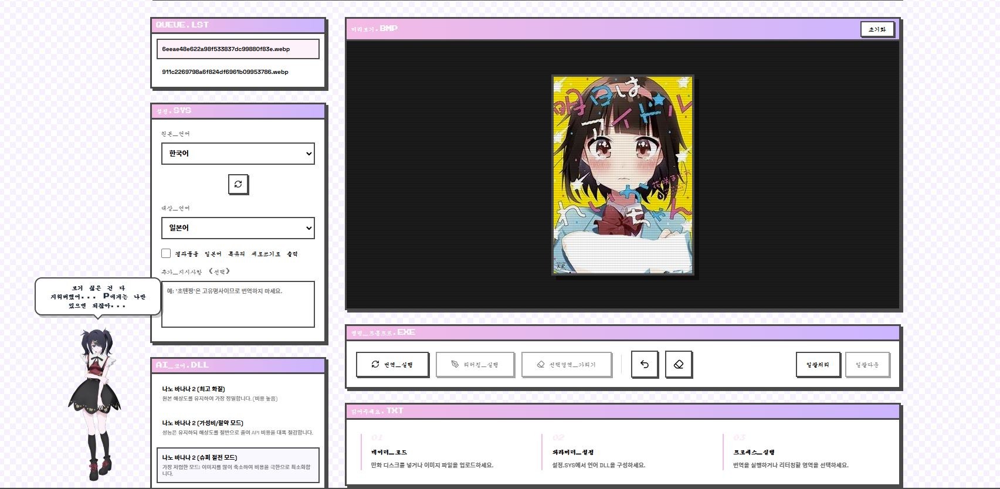

# 쵸텐짱의 제미나이 번역기

만화 페이지의 말풍선을 번역해 이미지 위에 다시 그리는 웹 앱이다. 보이스 웹툰 제작사 두비덥에서 쓰려고 만든 사내 도구다.
Gemini 이미지 모델에 원본 페이지를 보내면 원문을 지우고 번역문을 같은 자리에 써 넣은 이미지가 돌아온다.
따로 식자 작업을 하지 않아도 번역된 페이지가 나온다.

## 화면

배포판은 로그인이 필요해서 스크린샷으로 흐름만 정리했다.

### 일괄 번역 (한국어 → 일본어)

큐에 올린 순서대로 번역된다.



위 포스터의 결과물이다. 레이아웃과 서체 느낌은 그대로 두고 글자만 일본어로 바뀌었다.

<p align="center">
  
</p>

### 번역 결과 비교 (일본어 → 한국어)

일본어 라이트노벨 표지다. 세로쓰기 제목이 같은 자리에 한국어 세로쓰기로 다시 그려졌다.



### 가리기

세이프티 필터 때문에 번역이 거부되면 문제 영역을 흰색으로 가리고 다시 번역한다.
Gemini에는 흰색으로 칠한 이미지가 간다. 결과물에서는 그 자리에 원본 그림이 다시 보인다.



## 기능

- 이미지 여러 장 또는 폴더째 업로드. 파일 이름의 숫자 순서로 정렬
- 업로드할 때 긴 변을 2048px 이하로 줄이고 WebP(품질 85%)로 변환
- 언어 9개 (일본어, 한국어, 영어, 중국어, 스페인어, 프랑스어, 독일어, 베트남어, 태국어). 원본과 대상 언어 맞바꾸기 버튼
- 대상 언어가 일본어일 때 세로쓰기 옵션
- 프롬프트에 붙일 추가 지시사항 입력 (예: 고유명사 번역 금지)
- 리터칭: 마우스로 그린 영역만 다시 번역해 결과물에 덮어씀
- 가리기: 그린 영역을 흰색으로 칠해서 보냄. 번역 결과에는 그 자리의 원본을 되살림
- 실행 취소
- 일괄 처리: 아직 완료되지 않은 이미지를 차례로 번역
- 요청 한도(429)에 걸리면 3초, 6초, 12초 간격으로 세 번 재시도
- 완료본 ZIP 다운로드, 한 장씩 저장
- 진행 상황에 따라 말풍선으로 반응하는 캐릭터 두 명. 하단 `변신` 버튼으로 교체
- 작업 표시줄 BGM 플레이어 (2곡)

### 모델 선택

| 화면 이름 | 모델 | 보내는 이미지 긴 변 | WebP 품질 | 출력 크기 |
| --- | --- | --- | --- | --- |
| 나노 바나나 2 (최고 화질) | `gemini-3.1-flash-image-preview` | 2048px | 85% | 2K |
| 나노 바나나 2 (가성비) | `gemini-3.1-flash-image-preview` | 1024px | 70% | 1K |
| 나노 바나나 2 (슈퍼 절전) | `gemini-3.1-flash-image-preview` | 640px | 50% | 1K |
| 나노 바나나 1.5 | `gemini-2.5-flash-image` | 1024px | 75% | 지정 안 함 |

절약 모드는 같은 모델에 작은 이미지를 보내고 출력 크기를 1K로 묶어 비용을 줄인다.

## 실행

Node.js 22에서 확인했다.

```bash
npm install
```

프로젝트 루트에 `.env.local`을 만들고 [Google AI Studio](https://aistudio.google.com/)에서 받은 키를 넣는다.

```
GEMINI_API_KEY=발급받은_키
```

```bash
npm run dev
```

`http://localhost:3000`에서 열린다. 첫 화면은 사내용 로그인 창이다. 계정은 `src/App.tsx`의 `handleLogin`에 있다.

빌드는 `npm run build`, 타입 검사는 `npm run lint`다.

## 구조

```
src/App.tsx     화면, 프롬프트, Gemini 호출, 캔버스 합성 전부
src/index.css   Tailwind 테마와 레트로 창 스타일
public/         캐릭터 이미지 두 장과 BGM 두 곡
docs/           README 스크린샷
```

## 기술 선택

- 서버가 없다. 브라우저에서 `@google/genai`로 Gemini API를 바로 부른다.
- 그래서 API 키가 빌드 결과물(JS 번들)에 들어간다. 로그인 창은 화면만 막는다. 공개 주소에 올릴 때는 키 노출을 감수해야 한다.
- 결과물은 두 겹으로 합성한다. 아래는 손대지 않은 원본이고 위는 번역 이미지다. 가리기한 영역은 위 이미지에서 도려낸다.
- 리터칭은 그린 영역을 감싸는 사각형만 잘라 보낸다. 돌아온 이미지를 같은 자리에 붙인다.
- React 19, TypeScript, Vite 6, Tailwind CSS 4, motion, JSZip을 쓴다.
